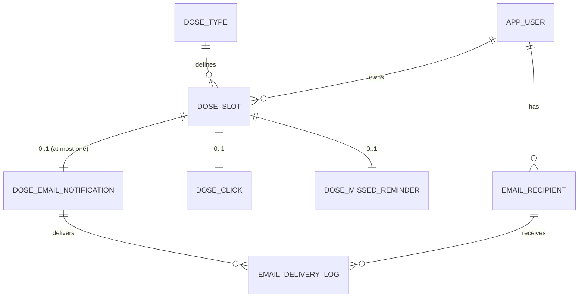

# 吃药了吗（TakeYourMedicine）数据库模式设计文档（MySQL 8）

## 目标与约束
- **目标**：将小程序“吃药了吗”的业务流程落为关系数据库模型，支撑点击触发邮件与超时触发邮件两类能力，并可审计、可扩展。
- **约束**：遵循第三范式（3NF），保证数据完整性与一致性；同时通过唯一约束与索引保证并发下的幂等与性能。
- **关键业务规则**：
  - 每天固定 3 次：早 09:00 / 中 12:00 / 晚 18:00（北京时区 `Asia/Shanghai`）。
  - 每次点击“吃了”：立即给指定邮箱发送邮件。
  - 若计划时间后 60 分钟内未点击：发送“未按时”邮件。
  - **同一用药时段（早/中/晚）每天最多发送 1 封邮件**（要么“已吃药”，要么“未按时”）。

## 业务流程与实体识别
### 业务流程
1. 系统为用户每天生成（或按需生成）3 个用药时段实例（早/中/晚）。
2. 用户点击“吃了”：
   - 记录一次点击行为（最多一次）。
   - 生成一条邮件通知意图，并对用户的收件邮箱列表生成投递任务。
3. 定时任务扫描超时未点击的时段：
   - 记录一次“超时未点击”事件（最多一次）。
   - 生成一条邮件通知意图，并对用户的收件邮箱列表生成投递任务。
4. 邮件发送 Worker 拉取投递任务，调用腾讯企业邮箱发送，并记录发送结果与错误信息。

### 主要实体（表）与职责
- `app_user`：小程序用户（按 openid 唯一）。
- `email_recipient`：用户配置的接收邮箱列表（支持多个、可启停）。
- `dose_type`：固定时段定义（AM/MID/NIGHT + 09:00/12:00/18:00）。
- `dose_slot`：**某用户在某天某时段的实例**（锚定“每日一次机会”）。
- `dose_click`：点击事件（每个 `dose_slot` 最多 1 条）。
- `dose_missed_reminder`：超时事件（每个 `dose_slot` 最多 1 条）。
- `dose_email_notification`：邮件通知意图（**每个 `dose_slot` 最多 1 条**，用于强制“最多发一次”）。
- `email_delivery_log`：投递日志（通知 -> 多收件人；记录状态、重试与错误）。

## 实体关系（ER）

## 设计要点（为何满足 3NF 与业务约束）
### 1) 3NF（第三范式）
- 静态字典数据放在 `dose_type`：避免把“09:00/12:00/18:00”冗余复制到每条业务记录。
- 用事实表 `dose_slot` 表达“某天某时段”这件事：其余事件（点击/超时/通知/投递）都依附于它。
- 发送结果与投递重试单独放在 `email_delivery_log`：不与点击/超时事件混杂，职责单一、可审计。

### 2) “每天每时段最多发一次”如何在数据库层强制
- `dose_slot`：`UNIQUE(user_id, dose_date_local, dose_type_id)` 保证每天每时段只有一个实例。
- `dose_click`：`PRIMARY KEY(dose_slot_id)` 保证每个时段最多一次点击记录。
- `dose_missed_reminder`：`PRIMARY KEY(dose_slot_id)` 保证每个时段最多一次超时事件。
- **关键** `dose_email_notification`：`UNIQUE(dose_slot_id)` 保证每个时段最多只有一条“邮件通知意图”（最终兜底并发与重试）。

### 3) 时间与时区
- 业务按北京时区，但数据库存储建议统一存 **UTC**（`*_utc` 字段），以便调度与比较一致。
- `dose_slot.dose_date_local` 保留北京时间日期用于业务归档与查询（如“今天早上是否已处理”）。

### 4) 性能与扩展
- 索引：
  - `dose_slot(planned_at_utc)`：定时任务按时间扫描。
  - `dose_missed_reminder(deadline_utc, status)`：可快速定位待处理。
  - `email_delivery_log(status, created_at)`：发送 Worker 拉取队列。
- 扩展方向：
  - 若未来引入多药品/多计划，可在 `dose_slot` 上增加 plan_id/medication_id 维度（当前按需求保持最简）。

## 交付物
- **建表与初始化 SQL**：`database/mysql/schema.sql`
  - 包含全部表结构、主键/外键/唯一约束、索引，以及 `dose_type` 的初始化数据。

